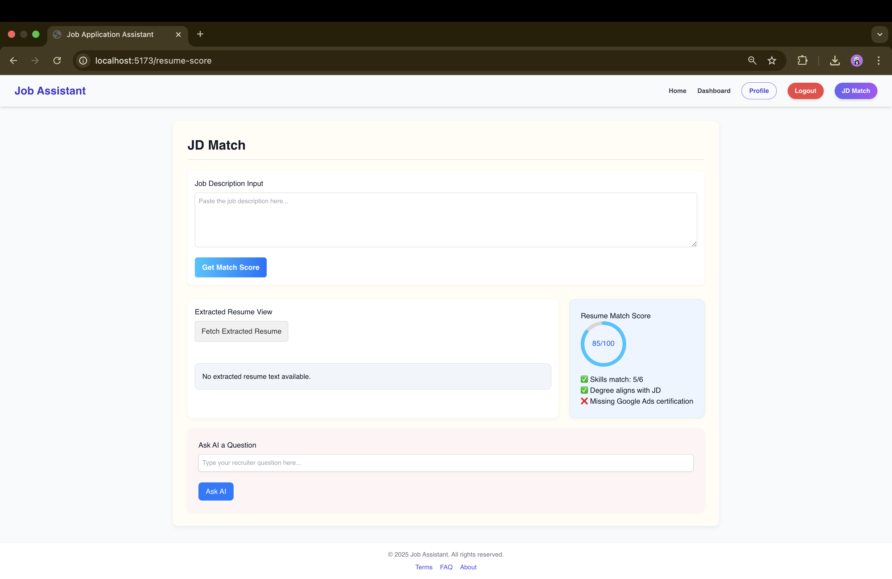
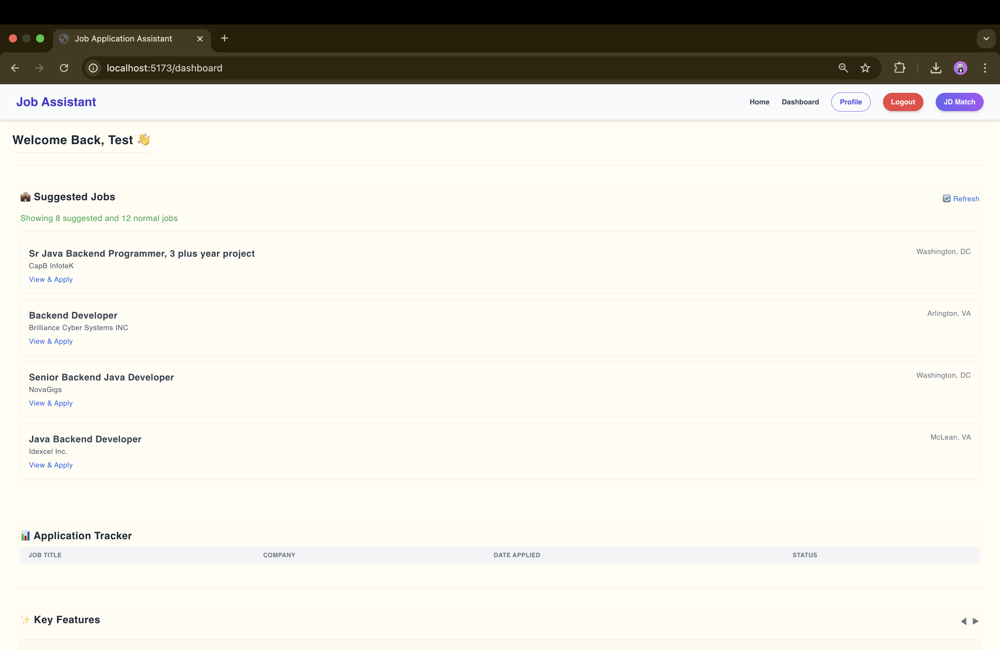

# 🤖 Job Assistant Agent

An AI-powered job application assistant that helps users apply smarter and faster using their resume, preferences, and powerful AI agents.

---


---

## 🚀 Features

| Feature                    | Status     | AI-Powered |
|---------------------------|------------|------------|
| ✅ Autofill Agent         | Completed  | Yes        |
| ✅ Resume-JD Score Agent  | Completed  | Yes        |
| ✅ Tailored Answers       | Completed  | Yes        |
| ✅ Cover Letter Generator | Completed  | Yes        |
| 🟡 External Form Submit   | Pending    | Soon       |
| 🟡 Application Tracker    | Pending    | Soon       |

- Multi-step user profile form (resume, preferences, skills)
- Job suggestions from JSearch API + AI filtering
- Autofill job application with resume + recruiter questions
- Resume vs JD scoring and insights
- Tailored cover letter and answer generation
- Application Tracker with status updates

---

## 🧠 Tech Stack

| Frontend            | Backend              | AI Services              | Database |
|---------------------|----------------------|---------------------------|----------|
| React + TailwindCSS | Node.js + Express    | DeepSeek R1 (Azure-hosted)| PostgreSQL + Prisma |
| React Router        | Zod Validation       | RapidAPI JSearch          | Multer for file upload |

---

## 🖼️ Screenshots

> 🧑‍💼 **Dashboard View**  


> 📝 **Tailored JD Matching Page**  


---

## 🛠️ How to Set Up Locally

### 🔁 Clone the Repo
```bash
git clone https://github.com/your-username/Job-Assistant-Agent.git
cd Job-Assistant-Agent
```

---

### 🖥️ Backend Setup

```bash
cd Backend
npm install
```

Create a `.env` file in the root of `Backend` folder:
```env
PORT=5000
DATABASE_URL=your_postgres_db_url
AZURE_API_KEY=your_azure_key
AZURE_API_ENDPOINT=https://your-azure-endpoint
RAPID_API_KEY=your_rapidapi_key
```

Run Prisma migrations:
```bash
npx prisma generate
npx prisma migrate dev --name init
```

Start backend server:
```bash
npm run dev
```

---

### 🌐 Frontend Setup

```bash
cd ../Frontend
npm install
```

Create a `.env` file in the root of `Frontend` folder:
```env
VITE_BACKEND_URL=http://localhost:5000
```

Start frontend dev server:
```bash
npm run dev
```

Open: `http://localhost:5173`

---

## 🧪 Testing the App Locally

- Sign up or log in with test user
- Upload resume and set preferences
- View Suggested Jobs → click Auto Apply
- Review recruiter answers, cover letter
  

---

## 📁 Folder Structure

```
Job-Assistant-Agent/
├── Backend/
│   ├── controllers/
│   ├── routes/
│   ├── prisma/
│   └── index.js
├── Frontend/
│   ├── src/
│   │   ├── components/
│   │   ├── pages/
│   │   └── api.js
│   └── index.html
└── Images/
    ├── Dashboard.png
    └── JDPage.png
```

---

## 💡 Future Enhancements

- Submit job to external forms (not just track)
- AI-powered resume rewriting
- Google OAuth login
- JD scoring analytics & visual insights
- Email job alerts
- Unit & integration tests
